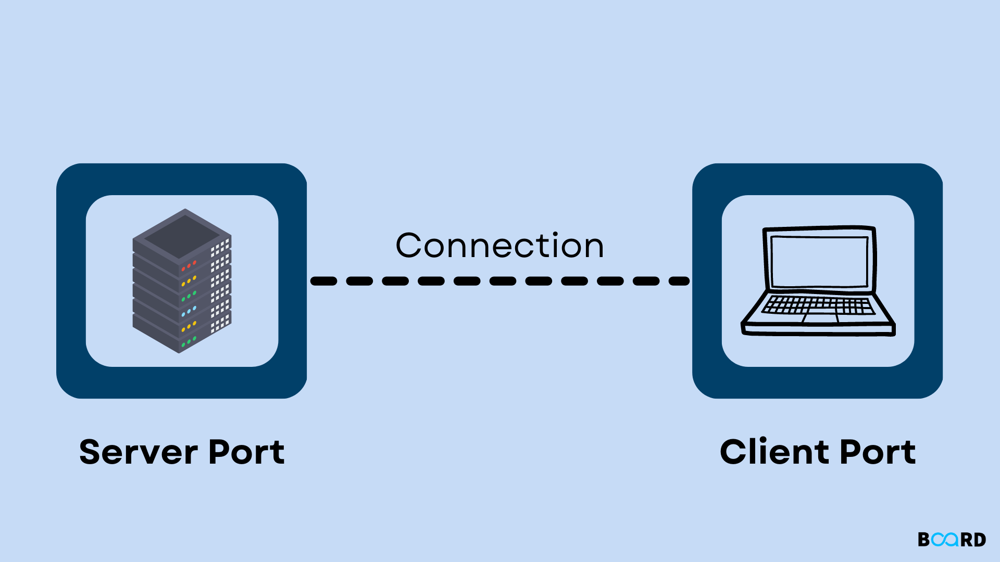

# Creating A Simple Real-Time Chat-App Using Python Sockets and Tkinter

***Sockets*** play a vital role in the domain of network programming, functioning as a flexible and effective method of communication among processes, devices, or applications across a network. In this context, a socket serves as a fundamental endpoint for the transmission and reception of data over a computer network. 

It presents a potent and versatile system for networking, granting developers the ability to construct a variety of networked applications seamlessly and efficiently. Whether the project entails crafting a straightforward chat application or a sophisticated distributed system, Python sockets act as the foundational framework for facilitating seamless communication in the digital landscape.

while ***Tkinter*** is widely recognized as the primary GUI ***(Graphical User Interface)*** toolkit for Python, offering developers a clear and potent method for crafting desktop applications that incorporate graphical interfaces. it is constructed based on the Tk GUI toolkit, which has its origins as an integral component of the Tcl (Tool Command Language) scripting language. 

In this blog you will be able to understand the process of how communication works in sockets, as well as the benefit of using Tkinter.

## Now, let's begin ##

Before we proceed in coding, I want to discuss the relationship of the client and server, which are very essential in our chat application. 

Imagine a server as a waiter in a restaurant and a client as a customer. The waiter (server) is prepared to take orders and deliver food. The customer (client) chooses what they want, requests it from the waiter, and the waiter satisfies the request.

In the context of computers, the server is similar to the waiter, offering a service, and the client is akin to the customer, making requests to the server. Sockets act as the language through which the waiter and customer communicate – a shared understanding. The waiter remains attentive for requests (listens for customers), and upon a customer's arrival (when the client connects), they communicate to fulfill the customer's needs (whether it's data or a service). Following that, the customer departs (the connection is closed). Various guidelines (protocols like TCP or UDP) ensure a seamless conversation.

**TCP and UDP**

TCP or Transmission Control Protocol is a connection-oriented protocol that ensures the reliability and an ordered data delivery making it suitable for applications prioritizing data integrity like file transfers. If you're going to use TCP, you have to create a socket using *socket.socket()*, and specifying the socket type by using *socket.SOCK_STREAM*.

On the other hand, UDP or User Diagram Protocol is a connectionless protocol that focuses on speed more than reliability. This type of socket is used in real-time application like gaming and streaming. 
